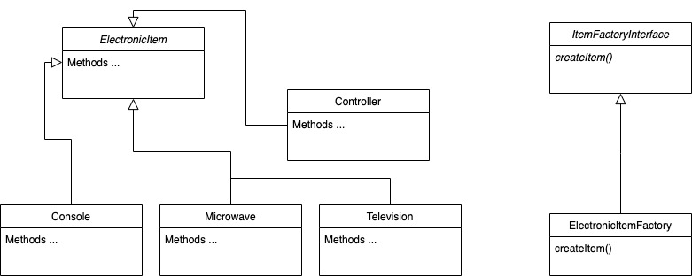

# Server specifications
* PHP >= 7.4
* Laravel 8
* Composer
* Git
* Apache | Nginx

# Installation

### Cloning the repository

```bash
git clone git@github.com:bakle/track.git
```

### Installing the project 

```bash
composer install
```

# Routes

### Purchase Detail
```bash
GET purchases/   
```

### Request Info
To try the 2 different scenarios you must pass the ``scenario`` param in the route.

```bash
GET purchases/default

// OR

GET purchases/many_extras
```

# Answers to questions

### Question 1
The answer to question 1 is given in the feature test ``ShowAllPurchaseTest.php``.
There are several cases, and it shows the total price as well as the ordered items.


### Question 2
The answer to question 2 is given in the feature test ``ShowSpecificPurchaseTest.php``.
There are several cases, and it shows the total price (filtered) as well as the filtered console item.

# Additional

### Scenarios
Scenarios are different purchase cases.

* The ``default.json`` scenario is the one given in the test.
* The ``many_extras.json`` scenario test the ``maxExtras`` feature.

### Unit tests
There is a unit test called ``ValidatorTest.php`` that validates the json scenario format.


# Implemented Design Patterns

* The **Decorator Patter** was implemented to retrieve the total price of all items including their extras.
* The **Factory Method Pattern** was implemented to create each ``ElementItem`` object.


### Decorator Pattern


### Factory Method Pattern

